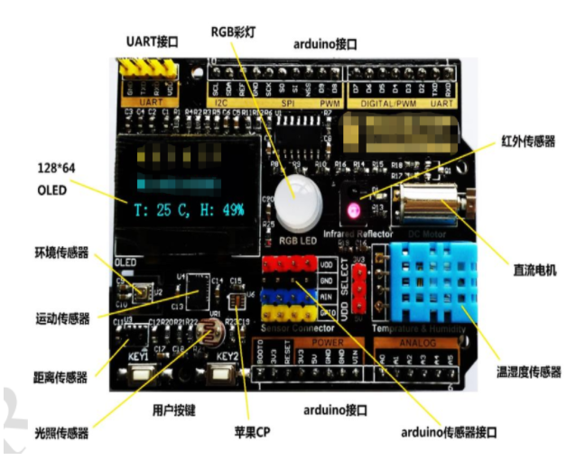

# 基于 AB32VG1 开发的项目说明

## 产品功能 
 1. 用户可以通过"盒子"的按键选择控制三色灯的开关和电机的开关 
 2. 通过"盒子"本地按键操作的灯和电机的状态可以同步到手机APP 
 3. oled屏同步显示控制内容和控制后的状态 
 4. 完善中。。

## 硬件说明
   因为AB32VG1的开发板接口是arduino的，所以外设是用到了以前工作的一个arduino接口的转接板，用到了硬件外设有
   
   - OLED（SPI接口）       --  软件模拟SPI：SCL:PA.0  SDA:PA.1  DC:PA.2  CS:PE.4
   - RGB_LED（IIC接口）    --  软件模拟IIC：SDA:PE.2  SCL:PE.3
   - 直流电机（GPIO）      --  使用IO：GPIO:PA.6
   - DHT11（GPIO）        --  使用IO：GPIO:PF.0
   - 按键（GPIO）         --  使用IO：电机控制按键:PE.1  灯控制按键:PA.5
   - 串口（UART）         --  使用串口1  波特率：115200

## 软件设计

         1.  软件初始化会创建线程"uart_thread"、"button_thread"、"event_manager_thread"、"dht11_thread"、"oled_thread"

         2.  串口线程"uart_thread"：负责与WiFi模组通讯，接受云端的控制指令和上报本地操作后的设备状态

         3.  按键线程"button_thread"：处理按键的不同触发状态，用来区分用户的按键方式来控制三色灯和电机的开关状态

         4.  时间管理线程"event_manager_thread"：用于对控制事件的接受和处理相对于的函数逻辑

         5.  温湿度检测传递线程"dht11_thread"：用于接收温湿度数据并传递给OLED显示对应状态

         6.  oled显示线程"oled_thread"：屏幕用于显示同步用户本地操作和操作结果

         7.  使用了消息队列和事件传递同于线程间通讯

         8.  SD card本想用sqlite3存储温湿度数值和一些音频内容，通过音频部分播出，所以，，还没做，，，

         9.  光敏传感器本想做夜晚休眠，白天开始工作，但比较普通，先鸽掉。。

         10.  本想做一个IoT网关，可以采集设备端数据的装置，但因为各种原因，做了个设备端，还只是演示的东西，还需优化改改

## B站演示视频地址
   [项目演示视频链接](https://www.bilibili.com/video/BV1pY411W726?share_source=copy_web)
    
## 开发板介绍

ab32vg1-prougen 是 中科蓝讯(Bluetrum) 推出的一款基于 RISC-V 内核的开发板，最高主频为 120Mhz，该开发板芯片为 AB32VG1。

该开发板常用 **板载资源** 如下：

- MCU：AB32VG1，主频 120MHz，可超频至 192MHz，8Mbit FLASH ，192KB RAM。
- 常用外设
  - LED: RGB灯
  - 按键: 3 个, USER(s2,s3) and RESET(s1)
- 常用接口：USB 转串口、SD 卡接口

## 外设支持

本 BSP 目前对外设的支持情况如下：

| **板载外设** | **支持情况** | **备注**                                  |
| :----------- | :----------: | :---------------------------------------- |
| USB 转串口   |     支持     |                                           |
| SD卡         |     支持     |                                           |
| IRDA         |     支持     |                                           |
| 音频接口     |     支持     | 支持音频输出                              |
| **片上外设** | **支持情况** | **备注**                                  |
| GPIO         |     支持     | PA PB PE PF                               |
| UART         |     支持     | UART0/1/2                                 |
| SDIO         |     支持     |                                           |
| ADC          |     支持     | 10bit ADC                                 |
| SPI          |   即将支持   | 软件 SPI                                  |
| I2C          |     支持     | 软件 I2C                                  |
| RTC          |     支持     |                                           |
| WDT          |     支持     |                                           |
| FLASH        |   即将支持   | 对接 FAL                                  |
| TIMER        |     支持     |                                           |
| PWM          |     支持     | LPWM 的 G1 G2 G3 之间是互斥的，只能三选一 |
| FM receive   |     支持     |                                           |
| USB Device   |   暂不支持   |                                           |
| USB Host     |   暂不支持   |                                           |

